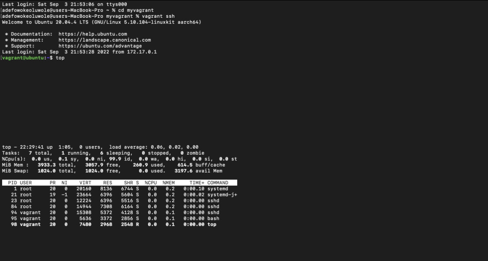
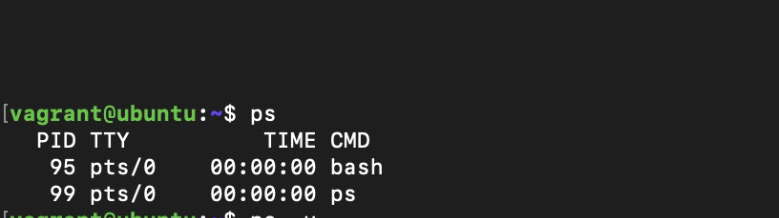
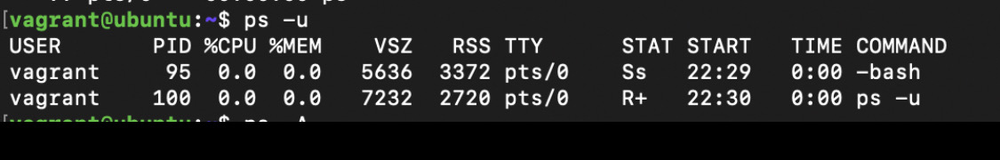
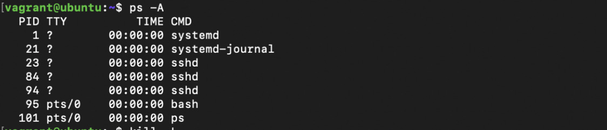
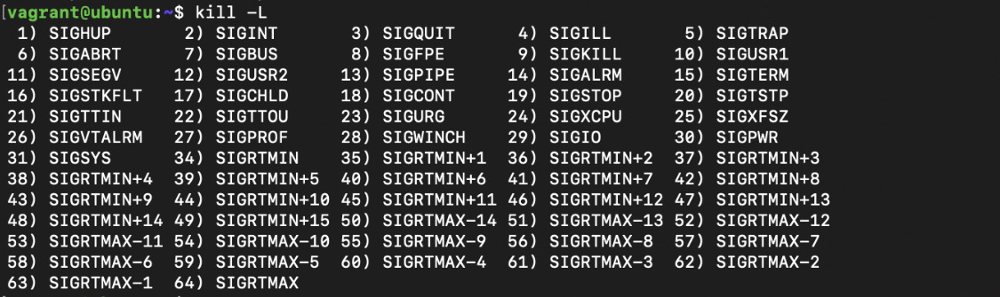
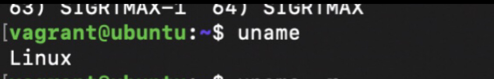
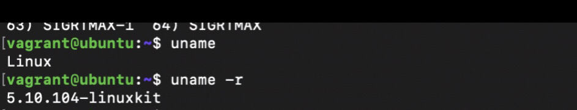
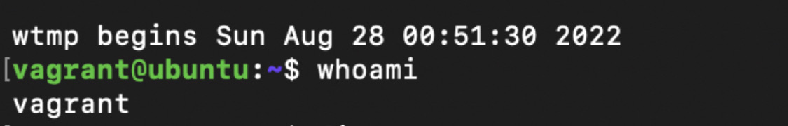
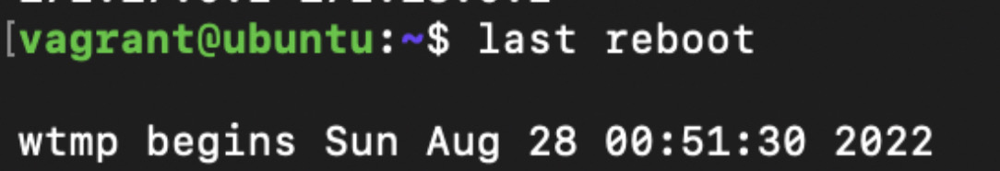
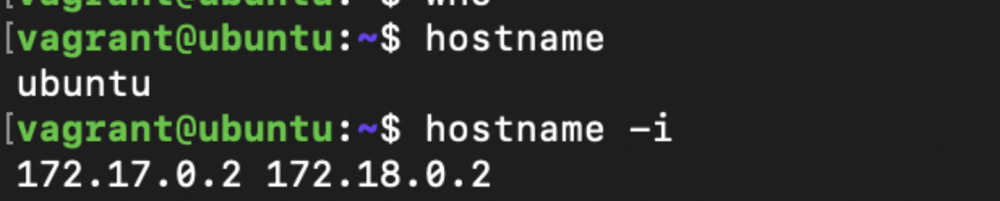

# This is a list of 10 Linux Commands and their uses

1. $ top: This is used to display all running processses  

2. $ ps: This is used to display currently active processes 

3. $ ps -u: This is to get more information on ps command 

4. $ ps -A: This lists out all the processes that are both running and not running 

5.$ kill -L: This is used to list out different types of kill signals 

6. $ uname: This displays Linux system information 

7. $ uname -r: This displays kernel release information 

8. $ whoami: This displays who you are logged in as 

9. $ last reboot: This shows system history 

10. $ hostname: This shows the system hostname 